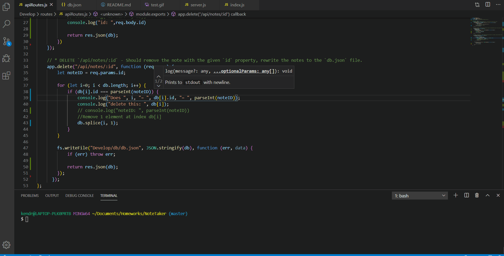

  # NoteTaker
 (https://github.com/kkwoka/NoteTaker)
  ​
  ## Description
  ​
  This project uses express to allow a user to write notes to ('GET') and delete notes from ('POST') a json file. 
  ​
  ## Table of Contents 
  * [GIF](#gif)

  * [Installation](#installation)
  ​
  * [Usage](#usage)
  ​  ​
  * [Contributing](#contributing)
  ​
  * [Tests](#tests)
  ​
  * [Questions](#questions)

  ## GIF
  

  ​
  ## Installation
  ​
  To install necessary dependencies, run the following command:
  ```
  npm i
  ```

  ## Usage
  ​```
  running on PORT 3010  ​
  ​```

  ## Tests
  ​
  To run tests, run the following command:
  ```
  In terminal --> node server.js
  ```
 
  ## Questions
  ​
  
  ​
  If you have any questions about the repo, contact [kkwoka](https://github.com/kkwoka).